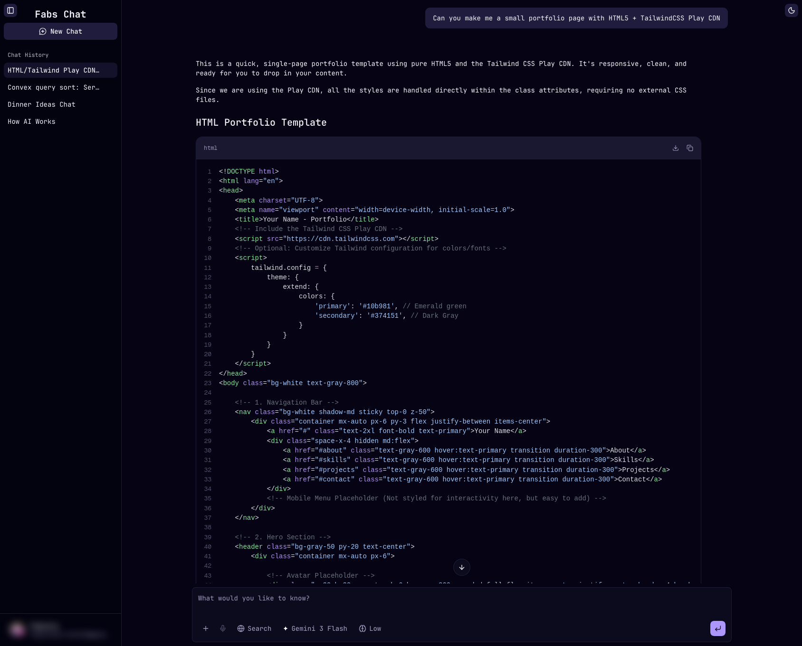

**🎉 Happy New Year!**

My latest project, **Fabs Chat** (multi-modal chatbot/chat app), is live for beta users at [fabs.chat](https://fabs.chat/).

01-16-26 Update
 - Sign-in/Sign-up has been restored.
 - QOL update: Converstaion metadata is stored to save previous session's settings.

01-15-26 Update
 
 - Sign-in has been temporarily disabled due to issues outside my control.
 - Attachment support are also disabled for now.
 - Guest mode is now being prioritized, planned for release on 01-18-26, and will allow limited usage of Gemini models only.

01-14-26 Update

 - Attachment uploads are now supported, limited to 5MB per chat (more usage will be allowed in a future update).
 - QOL updates: saving prompt inputs between sessions and editing messages now stores chat metadata (e.g., models, web search, reasoning, and attachments).

01-12-26 Update
 - More model support! We now support DeepSeek, Grok, Kimi K2, MiniMax, and OpenAI models.

Preview:

<!--
**fabstorres/fabstorres** is a ✨ _special_ ✨ repository because its `README.md` (this file) appears on your GitHub profile.

Here are some ideas to get you started:

- 🔭 I’m currently working on ...
- 🌱 I’m currently learning ...
- 👯 I’m looking to collaborate on ...
- 🤔 I’m looking for help with ...
- 💬 Ask me about ...
- 📫 How to reach me: ...
- 😄 Pronouns: ...
- ⚡ Fun fact: ...
-->
